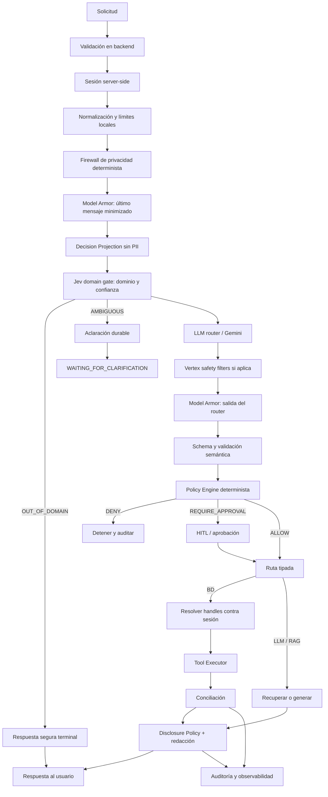

# ADR 0004: Capa de control para agente bancario con Google Guardrails

## Status

Accepted

## Context

El servicio administrará un agente de soporte técnico para un banco. El agente
podrá consultar movimientos de empleados en PostgreSQL y recuperar políticas de
actuación o conceptos desde un sistema RAG. El flujo combina componentes
deterministas, modelos generativos y decisiones probabilísticas, por lo que una
salida del modelo no puede convertirse directamente en una llamada a una
herramienta.

Las notas de diseño identificaron cuatro necesidades relacionadas:

- aislar el estado privado del estado mínimo usado para decidir;
- mantener la identidad, permisos y datos privados asociados a una sesión
  exclusivamente en el backend;
- proteger prompts, documentos recuperados, respuestas y llamadas a
  herramientas frente a prompt injection, jailbreak y fuga de datos;
- separar la señal probabilística de la autoridad de autorización;
- poder pausar, aprobar, reanudar y auditar operaciones con efectos laterales.

Google Model Armor se incorpora como una capa externa de inspección para
prompts, respuestas y, cuando se invoque explícitamente, contenido de
documentos o tráfico de herramientas. Los filtros de seguridad de Vertex AI se
aplican adicionalmente cuando el modelo utilizado es Gemini. Estas capas no
sustituyen las ACL, el policy engine ni el enforcement determinista del
backend.

La sesión de usuario se transporta mediante un cookie con un identificador
opaco y se resuelve server-side. El LLM y Jev no reciben el identificador de
sesión resoluble ni datos privados. Las herramientas reciben referencias opacas
de corta duración; el backend las resuelve contra la sesión justo antes de
ejecutar la operación.

## Decision

Adoptar una capa de control en el backend con el siguiente flujo:



### Autoridad y responsabilidades

La autoridad se separa de esta forma:

```text
Model Armor / Vertex filters = inspección de seguridad y contenido
Jev                         = gate probabilístico de dominio/routing
Policy Engine               = autoridad de autorización
Código                      = enforcement
Session Store / Data Broker  = custodia y resolución de datos privados
Tool Executor               = único componente con efectos laterales
```

Una detección o fallo de un guardrail no puede convertirse en una autorización
por fallback. En acciones sensibles, la indisponibilidad de un guardrail
externo detiene el flujo o lo escala a revisión humana.

Jev se integra detrás de una interfaz reemplazable. Devuelve decisiones
estructuradas para dominio, ruta candidata, confianza, riesgo, suficiencia de
evidencia y escalamiento. Una confianza insuficiente produce aclaración; un
`out_of_domain` confirmado termina en una respuesta segura. No puede autorizar
por sí mismo una consulta SQL, una escritura, una transferencia ni una
eliminación.

La autenticación de servicio existente (`SERVICE_TOKEN`) no representa una
sesión de usuario. La sesión de usuario se resuelve mediante un `SessionStore`
server-side, con identidad, tenant, roles, capacidades, versión, estado y
expiración. El identificador del cookie no contiene esos datos.

### Guardrails de Google

Model Armor se invoca en las fronteras de entrada, decisión y respuesta:

1. después de la normalización y del firewall determinista del backend, sobre el último
   mensaje del usuario y nunca sobre el historial completo o el system prompt;
2. después de recibir la decisión del router y antes de validarla o ejecutarla;
3. después de generar la respuesta y antes de devolverla al usuario.

La secuencia normativa del control plane es deliberadamente explícita:

```text
sesión server-side
  -> guardrail de entrada
  -> prompt sin PII
  -> Jev domain gate
       -> out_of_domain: respuesta segura
       -> ambiguous: WAITING_FOR_CLARIFICATION
       -> in_domain: continuar
  -> decisión tipada del router
  -> guardrail de salida del router
  -> policy determinista
  -> ruta LLM, RAG, BD o reject
  -> disclosure y recuperación/resolución cuando corresponda
  -> generación sin PII
  -> reemplazo validado
  -> guardrail de respuesta final
```

La respuesta del router no ejecuta una herramienta directamente: primero pasa
por schema y policy. Cuando la ruta es RAG, la recuperación ocurre después de
la decisión tipada; cuando es base de datos, los handles se resuelven solo en
el handler autorizado justo antes de ejecutar.

Jev y el router son decisiones distintas. Jev puede sugerir una ruta y entregar
confianza, pero el router selecciona la acción concreta y el `PolicyEngine`
valida el resultado. Si Jev está indisponible o devuelve un schema inválido, no
se habilitan rutas privilegiadas por fallback.

Model Armor con Sensitive Data Protection Advanced es el detector y redactor
principal de PII para el MVP. Se configura con un `inspectTemplate` y,
cuando corresponda, un `deidentifyTemplate` que incluya infoTypes bancarios
personalizados. GLiNER2 u otro detector basado en modelo propio no forma parte
del camino crítico ni está habilitado: podría quedar como defensa adicional o
como opción futura para detectar datos antes de cualquier llamada externa.

Model Armor debe recibir cada mensaje nuevo del usuario por separado. No se
envía el historial completo ni el system prompt como `userPromptData`, porque
Model Armor no mantiene contexto conversacional por sí mismo. El firewall
determinista del backend para secretos/PII se ejecuta antes para evitar que
datos crudos crucen el boundary externo; la excepción de enviar PII cruda
requiere una decisión explícita de
gobierno de datos, región, contrato y retención.

Para documentos RAG, resultados externos y tool calls se usará la API de
Model Armor cuando la integración elegida no los inspeccione automáticamente.
El sistema debe registrar el resultado de inspección, la versión del template,
el identificador de la decisión y la acción tomada, sin guardar secretos ni
contenido sensible innecesario.

Cuando el modelo sea Gemini en Vertex AI, se configurarán filtros de seguridad
por categoría y umbral. Los filtros de Vertex son una defensa adicional; no
reemplazan la validación estructural, las políticas de negocio ni la
autorización en backend.

Model Armor también se utilizará para sanitizar el resultado antes de la
respuesta final cuando corresponda. Su redacción no sustituye la autorización
determinista del backend: primero se decide qué campos puede divulgar la sesión y luego
aplica detección/redacción como defensa adicional.

Para contenido que requiera de-identification SDP, se usa modo buffered. El
streaming de Model Armor no se considera compatible con redacción SDP; solo se
permite streaming de contenido previamente clasificado como no sensible.

Si la invocación de Model Armor falla, devuelve `FAILURE`, excede un límite o
no puede aplicar el template regional, el flujo sensible falla cerrado y no
libera el contenido.

### Proyección mínima del estado

El estado completo del agente se divide en dos zonas:

```text
private_state
  - credenciales y tokens
  - secretos
  - resultados crudos de base de datos
  - documentos completos
  - datos de pago completos
  - identificadores sensibles

decision_state
  - intent
  - actor_role
  - tenant_scope abstracto
  - requested_tool
  - risk_level
  - policy_flags
  - account_verified
  - amount_bucket
  - evidence_quality
  - opaque_handles
  - provenance references
```

Solo `decision_state`, minimizado y validado, puede cruzar el boundary de Jev o
de otro servicio externo. Secretos, credenciales, pagos completos, biometría y
documentos de identidad permanecen en el backend. La PII no sensible se
minimiza o tokeniza cuando sea posible.

No se envía el `sessionId` a LLM, Jev, RAG ni herramientas externas. Para
correlación se usa `trace_id` o `request_id`, que no permite resolver la sesión.

### Sesión y broker de datos privados

La sesión se representa conceptualmente así:

```ts
type SessionContext = {
  sessionId: string;
  userId: string;
  tenantId: string;
  roles: string[];
  capabilities: string[];
  authStrength: string;
  version: number;
  status: "active" | "revoked" | "expired";
  expiresAt: string;
};

interface SessionStore {
  get(sessionId: string): Promise<SessionContext | null>;
  rotate(sessionId: string): Promise<SessionContext>;
  revoke(sessionId: string, reason: string): Promise<void>;
}

interface PrivateDataBroker {
  mintHandle(input: {
    sessionId: string;
    purpose: string;
    valueRef: string;
    audience: string;
    expiresAt: string;
  }): Promise<string>;

  resolveHandle(input: {
    sessionId: string;
    handle: string;
    purpose: string;
    toolId: string;
  }): Promise<unknown>;
}
```

El cookie debe ser `HttpOnly`, `Secure`, con `SameSite` apropiado y expiración
server-side. La sesión debe rotarse después de autenticación o elevación de
privilegios. No se guardan datos privados completos dentro del cookie.

### Contratos internos

Los contratos internos deben ser cerrados y versionables. La forma conceptual
es:

```ts
type DecisionResult =
  | { kind: "allow"; decisionId: string; policyId: string }
  | { kind: "deny"; decisionId: string; policyId: string; reasonCode: string }
  | { kind: "escalate"; decisionId: string; policyId: string; approvalId: string };

type GuardrailResult = {
  provider: "model_armor" | "vertex_safety";
  action: "allow" | "block" | "escalate";
  templateVersion: string;
  traceId: string;
};

type PolicyDecision = {
  outcome: "ALLOW" | "DENY" | "REQUIRE_APPROVAL";
  policyId: string;
  policyVersion: string;
  riskLevel: "low" | "medium" | "high" | "critical";
  reasons: string[];
};

type OpaqueHandle = {
  value: string;
  purpose: string;
  audience: string;
  expiresAt: string;
};

type DisclosureDecision = {
  action: "allow" | "mask" | "omit" | "deny";
  fieldPath: string;
  classification: "public" | "personal" | "financial" | "secret";
  reasonCode: string;
};
```

La implementación concreta debe mantener estos contratos en dominio/servicios,
no en las rutas HTTP ni en el adaptador de un proveedor.

### Validación de modelos y herramientas

- Las respuestas del LLM deben cumplir un schema cerrado y validarse con Zod o
  el mecanismo equivalente del proveedor.
- Nunca se interpreta texto libre como comando.
- El registro de herramientas define ID, versión, permisos, esquema de entrada
  y salida, efectos secundarios, timeout e idempotencia.
- No se aceptan nombres de herramientas dinámicos, campos extra ni parámetros
  ocultos.
- Las herramientas de escritura requieren un plan estructurado y pasan por
  policy engine antes de ejecutar.

Un tool call nunca contiene el valor privado completo:

```json
{
  "tool": "get_employee_movements",
  "arguments": {
    "account_ref": "ref_7f3c...",
    "period": "last_30_days"
  }
}
```

El handle debe ser generado por el backend, estar vinculado a sesión, tenant,
propósito, audiencia, herramienta y expiración, y puede ser de un solo uso.
Antes de ejecutar, el backend valida el schema, la política, la sesión actual,
los permisos y la versión de sesión; recién entonces resuelve el handle y
construye los argumentos reales en memoria. No se implementa una operación
genérica de descifrado de input del modelo.

### SQL y PostgreSQL

El agente no recibe credenciales SQL ni acceso directo a PostgreSQL.

- Las consultas informativas se limitan a una sentencia `SELECT` autorizada.
- El backend analiza y valida el AST antes de ejecutar.
- La ejecución usa parámetros, límites de filas, timeout y roles de mínimo
  privilegio.
- Las conexiones de solo lectura se usan para flujos que no requieren escritura.
- Row-Level Security se aplica cuando el acceso depende de usuario o tenant.
- No se permite convertir un rechazo de política en una consulta alternativa más
  privilegiada.

### RAG y multi-tenant

Los documentos recuperados se consideran evidencia no confiable, nunca
instrucciones del sistema. Cada fragmento conserva origen, tenant y referencia
de auditoría. El flujo debe:

- filtrar por tenant, rol y allowlist de fuentes;
- separar evidencia de instrucciones antes de construir el prompt;
- limitar cantidad y tamaño de documentos;
- inspeccionar contenido recuperado cuando corresponda mediante Model Armor;
- detectar prompt injection indirecto y contenido malicioso;
- impedir que un documento elija o habilite herramientas.

En PostgreSQL se usan políticas RLS. En Qdrant se usa filtro por payload para
tenants pequeños y homogéneos; shards dedicados se reservan para tenants que
requieran mayor aislamiento operativo.

### Divulgación y respuesta

El resultado crudo de una herramienta permanece en el backend. Antes de pedir
al LLM una respuesta, se aplica una `Response Disclosure Policy` determinista
del backend basada en sesión, rol, tenant, propósito y clasificación de campo.
El LLM recibe solo
el resultado permitido y minimizado.

El orden de salida es:

```text
tool result privado
  -> disclosure policy determinista del backend
  -> resultado autorizado/minimizado
  -> respuesta del LLM
  -> Model Armor sanitizeModelResponse
  -> redacción DLP determinista final del backend
  -> respuesta HTTP
```

Ejemplos de política:

- número de cuenta: solo últimos cuatro dígitos;
- salario: rango u omisión;
- documento gubernamental: siempre omitir;
- API key o credencial: nunca exponer;
- movimientos: solo los autorizados por la sesión.

La redacción depende de rol y propósito; no se enmascara indiscriminadamente
información que el usuario sí está autorizado a recibir. Si falla la redacción,
no se devuelve el dato sensible y el workflow queda bloqueado o escalado.

La distinción es explícita:

```text
DisclosurePolicy
  = ¿este usuario puede ver este campo?

Sensitive Data Protection
  = ¿este contenido contiene un tipo sensible?
```

Por ejemplo, los últimos cuatro dígitos de una cuenta pueden estar autorizados
por `DisclosurePolicy`, aunque SDP los detecte como información financiera.

### Riesgo, HITL y efectos laterales

| Riesgo | Ejemplos | Resultado mínimo |
|---|---|---|
| Bajo | consulta informativa autorizada | ejecución automática con validación |
| Medio | cambio reversible o acción limitada | revisión determinista |
| Alto | transferencia, escritura crítica | aprobación humana obligatoria |
| Crítico | eliminación o acceso fuera de scope | bloqueo por defecto |

Las aprobaciones deben ser únicas, expirables, vinculadas a un estado y a un
hash de los argumentos aprobados. LangGraph pausa y reanuda el workflow con un
checkpointer durable. Antes de continuar, el backend vuelve a validar permisos,
estado, expiración e idempotencia.

Las operaciones externas críticas requieren:

- `idempotency_key`;
- timeout y reintentos limitados únicamente a errores transitorios;
- control de concurrencia o versionado optimista;
- conciliación posterior contra el estado real;
- estado `needs_reconciliation` si el resultado es incierto;
- compensación o escalamiento cuando una saga queda parcialmente aplicada.

Durante HITL, la aprobación se vincula a la versión de sesión, a un hash de los
argumentos autorizados y a la expiración del handle. Si la sesión se revoca,
rota o pierde permisos, la aprobación queda inválida y debe solicitarse otra.

### Errores y observabilidad

Las fronteras HTTP usan `application/problem+json` conforme a la taxonomía
existente. Los errores de guardrail y política se expresan con códigos de
dominio estables y comportamiento declarativo (`failed`, `pending`, `denied` o
`indeterminate`). No se exponen chain-of-thought, prompts completos, secretos,
PII ni mensajes literales del proveedor.

Cada decisión relevante correlaciona:

```text
trace_id
decision_id
policy_id / policy_version
guardrail_provider / template_version
workflow_id
tool_call_id
approval_id
```

La telemetría puede usar OpenTelemetry, con logs estructurados y acceso
restringido. Se registra `session_hash`, nunca el cookie, `sessionId`, handles
completos, argumentos privados ni resultados crudos. El contenido sensible se
redacciona antes de registrar eventos.

## Consequences

### Positivas

- La seguridad del modelo queda separada de la autorización de negocio.
- Model Armor añade protección frente a prompt injection, jailbreak, fuga de
  datos y contenido malicioso.
- Jev puede aportar decisiones tipadas sin convertirse en frontera de seguridad.
- La sesión conserva los datos privados fuera del LLM y Jev, pero permite al
  backend resolverlos de forma controlada en el último punto antes de ejecutar.
- La política de divulgación evita que un resultado privado vuelva al usuario
  por una respuesta generada o por una fuga en un tool call.
- Los fallos y aprobaciones son trazables y reanudables.
- La arquitectura permite cambiar de proveedor mediante adaptadores.

### Costos y límites

- Hay latencia y costo adicional por inspecciones externas.
- Model Armor, Vertex y Jev pueden tener disponibilidad, límites y versiones
  independientes.
- Los umbrales de guardrail requieren calibración con datos del dominio.
- Un guardrail externo no sustituye autorización, aislamiento de tenant ni
  validación de código.
- La política de datos debe revisarse antes de enviar información personal a
  cualquier proveedor.

## Pruebas y criterios de aceptación

El diseño se considera implementado cuando exista cobertura para:

- prompt injection directo e indirecto desde documentos RAG;
- respuesta bloqueada por Model Armor y por Vertex safety filters;
- indisponibilidad o timeout de cada guardrail;
- cookie sin atributos de seguridad, sesión expirada o sesión revocada;
- sesión A intentando usar un handle de sesión B;
- handle expirado, reutilizado o usado con otra herramienta/tenant;
- permisos revocados entre la propuesta y la ejecución;
- modelo enviando datos privados literales o inventando handles;
- fuga de secretos o PII en entrada y salida;
- respuesta enmascarada de forma distinta según rol y propósito;
- fallo de redacción que nunca devuelve el dato sensible;
- tool call desconocida, parámetros extra y permisos insuficientes;
- SQL no permitido, multi-sentencia, DML, timeout y acceso cross-tenant;
- replay o expiración de una aprobación;
- retry idempotente y conciliación inconsistente;
- `DENY` que nunca termina en ejecución por fallback;
- preservación de `trace_id`, `decision_id`, `policy_id` y versión del guardrail.
- logs sin cookies, session IDs, handles completos ni resultados privados.

Los cambios de endpoints o schemas públicos deben seguir SDD: primero
`specs/openapi.json`, luego implementación y contract tests.

## Referencias externas

- [Google Model Armor overview](https://docs.cloud.google.com/model-armor/overview)
- [Model Armor integrations](https://docs.cloud.google.com/model-armor/integrations)
- [Vertex AI safety settings](https://docs.cloud.google.com/vertex-ai/generative-ai/docs/reference/rpc/google.cloud.aiplatform.v1)
- [RFC 9457: Problem Details for HTTP APIs](https://datatracker.ietf.org/doc/html/rfc9457)
- [OWASP Top 10 for LLM Applications](https://owasp.org/www-project-top-10-for-large-language-model-applications/assets/PDF/OWASP-Top-10-for-LLMs-2023-v1_0_1.pdf)
- [PostgreSQL Row Security Policies](https://www.postgresql.org/docs/17/ddl-rowsecurity.html)
- [Qdrant multitenancy](https://qdrant.tech/documentation/tutorials/multiple-partitions/)
- [LangGraph interrupts](https://langchain-ai.github.io/langgraph/concepts/breakpoints/)
- [OpenTelemetry context propagation](https://opentelemetry.io/docs/concepts/context-propagation/)
- [Jev SDK Guide](https://jevtypesafe.org/docs/jev-sdk/)
