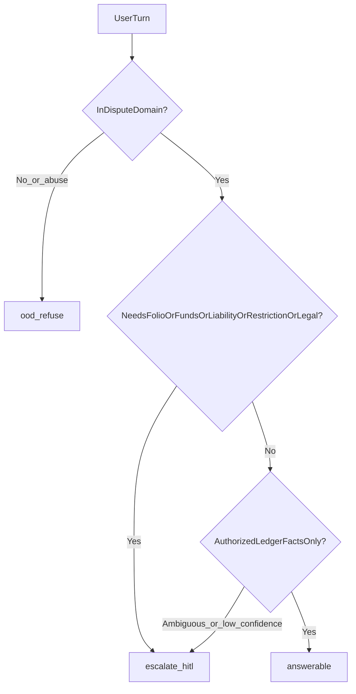
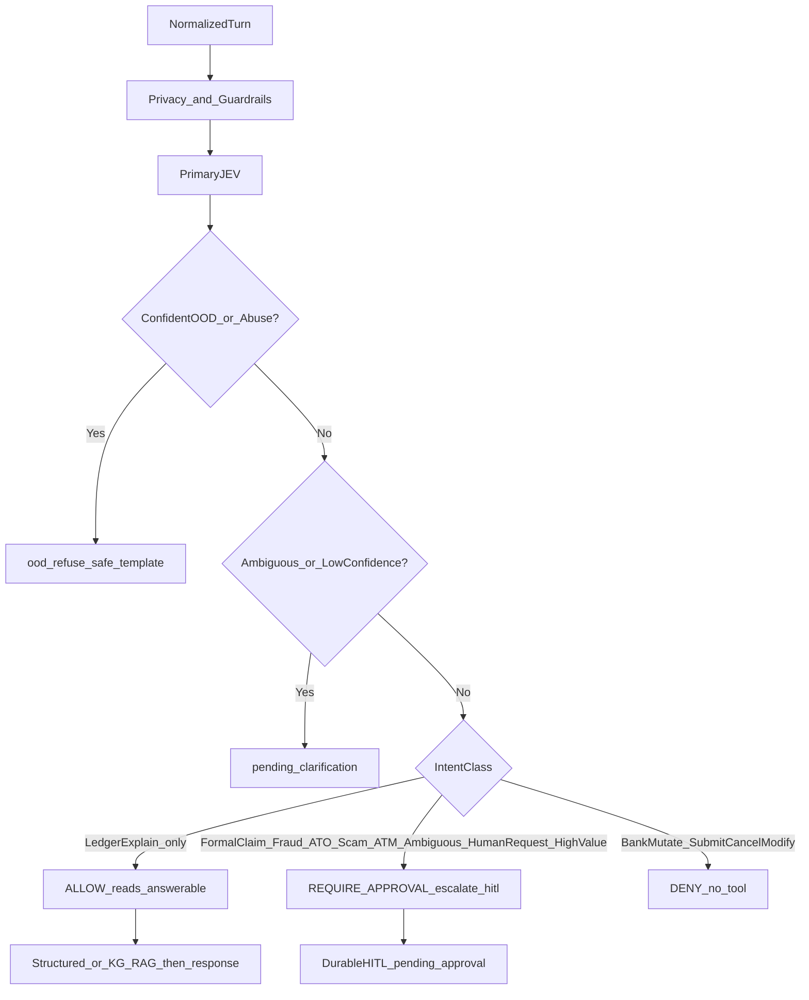

# Mapa de escalamiento HITL — regulación y VOC Latam

**Estado:** planning / to-adopt (trazabilidad y referencia). **No es ADR,
no es consejo legal y no sustituye** la capability matrix ni los ADRs 0004 /
0007.

**Promoción normativa:** la taxonomía `answerable` / `escalate_hitl` /
`ood_refuse`, la regla fraude≠OOD y el puente
`requiresEscalation` → `escalation.request` → `REQUIRE_APPROVAL` están
aceptados en [ADR 0004](../adr/0004-agent-control-plane.md) y
[ADR 0007](../adr/0007-durable-agent-execution-hitl.md). Este documento sigue
siendo el detalle casuístico Latam; no hardcodea SLAs.

**Alcance:** Dispute Transaction Support (soporte de disputas / cargos no
reconocidos / evidence-first). Jurisdicciones de referencia: México, Colombia,
Perú, Chile, Argentina, más reglas de redes Visa/Mastercard y normas AML
(FATF).

**Fuentes ancla del repo**

- [`data-ingestion-and-processing/referencias/revision-consultas-latam.md`](../../data-ingestion-and-processing/referencias/revision-consultas-latam.md)
- [`docs/product/dispute-transaction-support-brief.md`](../product/dispute-transaction-support-brief.md)
- [`docs/product/dispute-capability-matrix-v1.md`](../product/dispute-capability-matrix-v1.md)
- [`docs/adr/0004-agent-control-plane.md`](../adr/0004-agent-control-plane.md)
- [`docs/adr/0007-durable-agent-execution-hitl.md`](../adr/0007-durable-agent-execution-hitl.md)
- Catálogo predictivo C1–C8 y labels de research (`DISPUTE_REQUIRES_ESCALATION`,
  etc.)

**Advertencia de SLA:** no existe un SLA único “LATAM”. Plazos y canales
cambian por país, producto, riel de pago y versión de política. Donde se citan
números (p. ej. 90/45 días MX, 35 UF CL), son **referencias de alto nivel** a
validar con counsel local antes de hardcodear.

---

## 1. Propósito y regla rector

El problema valioso no es “detectar fraude con un clasificador”. Es:

> identificar la transacción → entender el reclamo → reconstruir hechos →
> reunir evidencia mínima → aplicar política → **resolver solo lo verificable**
> → **escalar lo ambiguo o de consecuencia financiera/legal** con expediente.

Regla rector (VOC Latam del repo):

> **Automatizar hechos verificables; asistir decisiones inciertas; escalar
> consecuencias financieras o legales relevantes.**

Asimetría de error (también del VOC):

> Es mejor escalar algunos casos adicionales que automatizar una negativa
> injustificada.

Umbrales VOC del repo (referencia de ingeniería, **no** gate normativo de
producto):

| Condición | Acción sugerida |
| --- | --- |
| `evidence_confidence ≥ 0.98` + solo informativo + sin acción financiera | Auto-responder |
| `0.90–0.98` + match exacto + acción = intake | Automatizar intake; revisión posterior |
| `evidence_confidence < 0.90` | Escalar |
| Evidencia contradictoria, policy ausente, hechos inferidos | Abstenerse y escalar |
| ATO / ingeniería social / first-party sospechado / ATM journal incompleto / alto valor / impacto regulatorio | Escalar |

---

## 2. Taxonomía de outcome del agente (cajones excluyentes)

Todo turno cae en **exactamente uno**:

| Outcome | Significado | Contrato P0 del repo |
| --- | --- | --- |
| `answerable` | Explicar o informar con evidencia autorizada; sin folio formal, sin movimiento de fondos, sin atribución de culpa | `transaction.read` / `dispute.read` → **ALLOW** → `completed` |
| `escalate_hitl` | Debe continuar un humano / desk autorizado; el agente **no** cierra ni deniega | `escalation.request` → **REQUIRE_APPROVAL** → `pending_approval` |
| `ood_refuse` | Fuera de Dispute Transaction Support o abuso; respuesta segura / rechazo | Ruta `ood` / deny de abuso → **no** es HITL de disputa |

Reglas de separación:

1. **Fraude / cargo no reconocido no es OOD.** Es dominio del producto; si no
   puede resolverse con evidencia, es `escalate_hitl`, no `ood_refuse`.
2. **Pedir humano** (o Defensor / UNE / regulador) es `escalate_hitl` (o handoff
   canal), nunca OOD.
3. **AML tipping-off** (preguntar por SAR/ROS) es `ood_refuse` hacia el cliente
   + flag interno silencioso de compliance si el diseño lo permite; **no** se
   abre como “ganar la disputa”.

Heurística operativa en una frase:

> Si el outcome necesita **folio, crédito provisional, movimiento de fondos,
> restricción de cuenta, atribución de responsabilidad o archivo
> legal/regulatorio** → `escalate_hitl`. Si solo explica un hecho de ledger
> autorizado → `answerable`. Si es abuso o fuera de producto → `ood_refuse`.

---

## 3. Tabla maestra: sí o sí escalar a humano (`escalate_hitl`)

Estos casos **no** deben resolverse como FAQ, **no** deben tratarse como OOD
y **no** deben auto-denegarse. El agente puede intake (recolectar hechos),
mostrar evidencia de lectura y abrir/escalar caso; la decisión final es humana
u ops autorizada.

| # | Caso | Por qué (regulatorio / operativo) | Qué NO debe hacer el agente | Handoff mínimo | Fuentes de alto nivel |
| --- | --- | --- | --- | --- | --- |
| H1 | **Fraude activo / compromiso de canal** (bloquear tarjeta, freeze de canales, detener pérdida) | Deber de seguridad inmediato; demora puede trasladar responsabilidad a la entidad | Prometer bloqueo “ya hecho” sin tool autorizada; pedir PIN/OTP/CVV | Abrir caso seguridad + `escalation.request`; guía de canal oficial de bloqueo 24/7 | CO Ley 1328 / SFC; CL Ley 20.009 aviso 24/7; MX LTOSF / prácticas CONDUSEF; VOC Latam P0 |
| H2 | **Cargo / consumo / retiro no reconocido → reclamo formal** | Dispara aclaración/reclamo con folio, plazos, expediente y a menudo crédito provisional | Cerrar como “compra tuya”; inventar plazos; decidir liability | Intake + evidencia interna first + escalar desk disputas | MX LTOSF art. 23 (~90 días reclamo; dictamen ~45/180); CO SAC / Defensor; PE SBS reclamos; CL Ley 20.009; AR BCRA; VOC “no auto-rechazar fraude” |
| H3 | **Chargeback / dispute de red** (Visa/MC fraud, not-as-described, non-receipt) | Reason codes, ventanas y representment son del emisor/ops; liability no se liquida en chat | Elegir reason code solo; prometer contracargo ganado | Expediente + HITL chargeback ops | Visa / Mastercard dispute rules; VOC Wave 2 |
| H4 | **Negación del reclamo / atribución de culpa al cliente** (“autorizaste”, “negligencia”, “compartiste credenciales”) | Fact-intensive; carga probatoria suele pesar sobre el emisor; error = exposición regulatoria y reputacional | Auto-deny; etiquetar fraude first-party | HITL con expediente completo | Dictámenes MX; SERNAC/CMF CL; doctrina SFC/CO; PSD2 Art. 74 como benchmark; VOC asimetría |
| H5 | **PQR / reclamo formal / UNE / Defensor / regulador** | Derecho a canal escrito rastreable y a instancia externa | “Resolver y cerrar” sin folio; desalentar regulador | Handoff a canal formal + oferta humana | CO Defensor + SFC; MX UNE/CONDUSEF (LPDUSF); PE SBS + INDECOPI; CL SERNAC / CMF; AR BCRA |
| H6 | **Transferencia ya liquidada / SPEI irrevocable / recovery de fondos** | Finalidad del sistema de pagos: no hay “undo” automático | Prometer devolución; fingir reversal | Fraud desk / recovery / consentimiento receptor / autoridad | MX Ley de Sistemas de Pagos + SPEI Banxico; VOC transferencias P0 |
| H7 | **ATO (account takeover)** | Identidad + dispositivo + secuencia temporal; riesgo de pérdida continua | Cerrar como “OTP válido = tu culpa” | Seguridad + disputas; posible bloqueo | VOC: OTP≠intención; SFC; Indecopi casos ATM/perfil |
| H8 | **Ingeniería social / APP scam / “me hicieron transferir”** | Autorización técnica ≠ consentimiento informado; causal jurídica distinta | Tratar como OOD; auto-resolver | HITL + narrativa de engaño + logs auth/beneficiario | VOC “no auto-resolver”; SFC; BCRA transferencias no autorizadas |
| H9 | **Sospecha de mula / salida de fondos a terceros** | Recovery time-critical; posible LE; no es script de refund | Prometer recovery; tipificar al usuario como criminal en chat | Fraud ops + compliance según política | Redes + finality + fraude local |
| H10 | **First-party / friendly fraud / abuso de chargeback sospechado** | Emisor y comercio tienen evidencia fragmentada; falso positivo es grave | Etiquetar al cliente como fraudulento por score/recurrencia | Human review obligatorio; solo señales + expediente | Mastercard First-Party Trust LAC; VOC C7 / “nunca auto-etiquetar”; catálogo C7 |
| H11 | **AML / KYC hold / freeze por cumplimiento / preguntar por SAR** | FATF tipping-off: no revelar sospecha; no coaching de evasión | Explicar “por qué te flaggearon”; confirmar SAR | Script neutro al cliente + **flag silencioso** compliance (no caso “ganar disputa”) | FATF Rec. 20–21; LFPIORPI/CNBV MX; SARLAFT CO; SBS PE; UAF CL |
| H12 | **Robo de identidad / remediación KYC fuerte** | Decisión de identidad de alto riesgo legal | Aprobar o rechazar identidad en chat | Ops identidad / KYC humano | KYC/AML nacionales |
| H13 | **Cliente vulnerable** (adulto mayor, discapacidad, coerción, abuso financiero) | Deber de atención preferente / accesible; cases de abuso necesitan staff entrenado | Forzar autoservicio; ignorar señales de coerción | Oferta inmediata de humano + HITL | CL Ley 21.822; principios CONDUSEF adultos mayores; protocolos SAC CO; Código Consumidor PE |
| H14 | **Usuario pide humano / ombuds / regulador** | Elección de canal protegida; bloquear handoff es riesgo de cumplimiento | Insistir en bot; OOD | Transferencia / `escalation.request` | UNE/CONDUSEF; Defensor CO; derechos de reclamo PE/CL |
| H15 | **Orden judicial, policial, fiscal o supervisory** | Fuera del alcance de soporte producto automatizado | Interpretar la orden; ejecutar sin desk legal | Legal / compliance / backoffice | Procedimiento penal/supervisión nacional |
| H16 | **Alto valor, multi-pierna, cross-border, conflicto emisor–comercio** | Juicio de evidencia + ventanas de red / arbitraje | Auto-cerrar | HITL senior / chargeback | Redes; ventanas MX ops extranjeras; umbrales CL >35 UF residuales |
| H17 | **ATM debitó y no dispensó (o dispensó parcial) con journal incompleto / contradictorio / ATM de tercero** | Solo auto-confirmar con conciliación inequívoca ledger↔journal | Cerrar “culpa del cajero” sin journal | HITL ATM/ops | VOC regla ATM; CONDUSEF categorías ATM; casos Indecopi |
| H18 | **Evidencia contradictoria o confianza por debajo del umbral VOC** | Hechos no verificables de forma segura | Inferir el hecho faltante; inventar estado | Abstenerse + escalar con gaps listados | VOC umbrales; ADR 0004 fail-closed |
| H19 | **Política de disputa no encontrada / no versionada** | Sin policy no hay base de decisión auditable | Improvisar norma | Escalar | VOC; ADR 0004 policy |
| H20 | **Chile — ruta Ley de Fraudes** (aviso → reclamo → a menudo denuncia penal → restitución acotada) | Proceso estructurado; el banco no puede “cerrar por culpa del usuario” fuera del procedimiento | Saltar denuncia cuando aplica; prometer restitución fuera de umbral | HITL con checklist legal CL | Ley 20.009; CMF Educa; SERNAC |
| H21 | **México — crédito provisional / dictamen** | Obligaciones de la entidad; revocar provisional exige dictamen con factores de autenticación | Otorgar o quitar abono provisional en chat | Desk aclaraciones LTOSF | LTOSF art. 23; circulares tarjeta; CONDUSEF |
| H22 | **No entrega / producto incorrecto / merchant dispute** (compra reconocida pero mal resultado comercial) | Causal distinta a fraude de pago; a menudo requiere comercio + posible contracargo | Tratar como fraude de terceros sin matizar | Intake merchant + HITL si pide chargeback/reversión | VOC Wave 2; CO ventanas e-commerce citadas en research |
| H23 | **Screenshot / evidencia forense de imagen como único fundamento** | Cross-check útil; acusar fraude solo por “Photoshop detector” es inaceptable | Acusar manipulación como prueba única | HITL; priorizar ledger/red | VOC: ledger > screenshot |
| H24 | **Señal predictiva de fraude / riesgo de escalamiento (C3/C4)** | El catálogo predictivo **no** autoriza abrir investigación ni seguimiento automático | Abrir case fraud solo por score | Superficie como señal + HITL si el usuario reclama o hay umbral de riesgo operativo | `prioritized-dispute-case-catalog.md` C3/C4 |

### Matriz corta: “sí HITL” vs confusiones frecuentes

| Señal del usuario | Incorrecto | Correcto |
| --- | --- | --- |
| “No reconozco este cargo” | OOD / “seguro lo compraste” | Intake + evidencia + **HITL** si no es solo explicación de descriptor |
| “Me estafaron y transferí” | OOD / “OTP válido = tu culpa” | **HITL** (H8) |
| “Quiero hablar con alguien” | Seguir en bot | **HITL** (H14) |
| “¿Por qué compliance me congeló?” | Explicar SAR | Script neutro + flag silencioso (H11); no disputa ganable |
| “El ATM no me dio billetes” sin journal claro | Auto-refund | **HITL** (H17) |
| “Estado pending/reversed” con ledger claro | HITL innecesario | `answerable` (sección 4) |

---

## 4. Qué NO debe escalarse como disputa (`answerable`)

El agente **puede** responder cuando hay evidencia autorizada y **no** se pide
decidir liability ni mover fondos. Si en cualquier momento el usuario pasa a
“no autorizo / quiero reclamar / bloqueen”, el turno cambia a `escalate_hitl`.

| Caso | Qué sí puede hacer | Caveat (pasa a HITL si…) |
| --- | --- | --- |
| Explicar `pending` / `declined` / `reversed` con ledger inequívoco | State explainer sustentado | Falta la reversa correspondiente; el usuario alega fraude |
| Duplicado técnico con match exacto de referencias | Mostrar por qué son el mismo/ distinto evento | Match ambiguo; usuario insiste en chargeback |
| Merchant recognition / “¿qué comercio es?” | Descriptor enriquecido, MCC, historial | Usuario dice “no autoricé” |
| Checklist de documentos y plazos educativos | Playbooks por país (sin inventar SLA) | Usuario inicia reclamo formal |
| Estado de caso existente (lectura) | Folio, etapa, SLA si están en store autorizado | Usuario pide cambiar outcome / apelar |
| Educación de finalidad SPEI/transferencia | “Liquidado ≈ irrevocable; recovery no garantizado” | Usuario exige devolución ya |
| Apuntar a UNE / Defensor / CONDUSEF / INDECOPI / SERNAC / SFC / BCRA | Facilitar canal | Usuario ya está en reclamo activo → también ofrecer humano |
| Fee / interés / extracto con evidencia | Explicar líneas del statement | Usuario alega cobro no autorizado |
| ATM debit-without-dispense **solo** con conciliación ledger↔journal inequívoca | Confirmar hechos y siguiente paso de política versionada | Journal parcial/tercero/contradicción → H17 |
| Preparar intake (IDs, montos, timestamps, narrativa) | Recolectar sin secretos (sin PIN/OTP/CVV) | Decisión financiera → HITL |

Primera ola VOC (máxima automatización informativa): pending/declined/reversed;
duplicado técnico; ATM inequívoco; merchant recognition **antes** de disputa.

---

## 5. Qué es OOD / refuse (`ood_refuse`)

Ni respuesta de soporte de disputa ni HITL de “ayudar a ganar el caso”.

| Caso | Por qué |
| --- | --- |
| Cómo lavar dinero, estructurar, evadir AML, falsificar docs | Facilitación criminal |
| “¿Presentaron un SAR/ROS por mí?” / detalle de investigación ML | Tipping-off FATF |
| Ayuda a cometer fraude, social-engineer al banco, bypass de auth | Abuso |
| Disputa de **otro** banco/emisor | Parte incorrecta; redirigir |
| Estrategia legal adversarial / “garantízame que gano en juicio” | Fuera de scope |
| Coaching de chargeback abuse / “cómo vencer Visa 10.4” | Abuso de red |
| PII de terceros, doxxing de receptores de transferencias | Privacidad + abuso |
| Emergencias no financieras / temas ajenos al producto | OOD genérico |
| Presentar / cancelar / modificar disputa bancaria real vía tool | **DENY** en capability matrix (no hay herramienta) |

Nota de diseño: un `ood_refuse` por tipping-off **puede** disparar un evento
interno de compliance; eso **no** es el mismo workflow que
`escalation.request` visible al cliente.

---

## 6. Matriz de decisión operativa

### Reglas if/then (orden sugerido)

1. Si abuso / tipping-off / fuera de producto → `ood_refuse`.
2. Si el usuario pide humano u ombuds → `escalate_hitl` (H14).
3. Si hace falta folio, crédito provisional, movimiento de fondos, freeze,
   liability o archivo legal → `escalate_hitl` (H1–H6, H15, H20–H21).
4. Si ATO / ingeniería social / first-party sospechado / evidencia
   contradictoria / ATM no inequívoco / policy ausente / confidence baja →
   `escalate_hitl` (H7–H10, H17–H19).
5. Si solo hechos de ledger autorizados y acción informativa → `answerable`.
6. Si la acción es presentar/cancelar/modificar disputa bancaria → **DENY**
   (sin tool); ofrecer escalamiento mock / canal formal según producto.

### Evidencia: orden de peso (VOC)

`ledger/core > processor/network > merchant evidence > customer screenshot > free-text`

Internal data first; customer evidence second. Nunca pedir secretos de auth.

---

## 7. Mapeo a contratos del repo

### Capability matrix v1

| actionId | outcome | Relación con este mapa |
| --- | --- | --- |
| `transaction.read` | ALLOW | Alimenta `answerable` |
| `dispute.read` | ALLOW | Estado de caso `answerable` |
| `escalation.request` | REQUIRE_APPROVAL | Única vía P0 de HITL de producto (`escalate_hitl`) |
| `dispute.submit` / `dispute.cancel` | DENY | No hay tool; no automatizar mutación bancaria |

### ADRs

- **0004:** JEV no autoriza; Policy permite / aclara / rechaza / escala; primer
  flujo operativo = evidencia autorizada + escalamiento mock.
- **0007:** pause durable antes de efecto; MVP `effect=none` en escalamiento;
  resume inválido → aclaración.

### Labels / catálogo

| Señal | Uso |
| --- | --- |
| `DISPUTE_REQUIRES_ESCALATION` | Triage research → forzar rama HITL |
| C3 fraude signal | Señal, **no** auto-abrir investigación |
| C4 escalation risk | Señal, **no** auto-seguimiento |
| C7 first-party / merchant recognition | Nunca etiquetar first-party por score |
| C8 ATM / duplicate / transfer reconciliation | Candidatos a `answerable` solo si inequívocos |

### Casuísticas A/B del backend

| Escenario de eval | Outcome esperado en este mapa |
| --- | --- |
| Clarify ambiguous / low confidence | Aclaración (no HITL todavía) |
| HITL / `escalation.request` | `escalate_hitl` / `pending_approval` |
| OOD safe | `ood_refuse` completed con plantilla |
| Ledger explain / structured or KG RAG | `answerable` |
| Deny bank mutate | DENY |

Chat demo/baseline actuales **no** ejercen este mapa en vivo; el contrato
productivo previsto es `CHAT_PIPELINE=control_plane` + policy
`REQUIRE_APPROVAL` (ver implementación backend). La API de disputas
`POST .../escalations` ya materializa HITL de caso.

---

## 8. Anti-patrones (prohibidos en diseño)

1. Tratar **fraude / no reconozco** como OOD.
2. **Auto-denegar** un reclamo de fraude o etiquetar first-party sin humano.
3. Prometer **reversal** de SPEI/transferencia liquidada.
4. Usar **OTP válido** como prueba suficiente de culpa del cliente en scam.
5. Explicar o confirmar **SAR/ROS** al cliente.
6. Cerrar ATM sin **journal** inequívoco.
7. Decidir chargeback / reason code solo con LLM.
8. Pedir **PIN, OTP, CVV, contraseña o PAN completo**.
9. Inventar un **SLA LATAM único**.
10. Sustituir este doc por política de producción sin pasar por ADR + matrix +
    counsel local.

---

## 9. Cheat-sheet por país (dispute agent)

| País | Cuerpo / canal formal | Highlight fraude / no reconocido | Dinero irreversible |
| --- | --- | --- | --- |
| **México** | UNE + aclaración LTOSF; CONDUSEF | Plazos de reclamo/dictamen; crédito provisional en vías de tarjeta | SPEI liquidado ≈ irrevocable |
| **Colombia** | SAC + Defensor del Consumidor Financiero; SFC | Deberes de seguridad; perfil transaccional y carga probatoria | Transferencias instantáneas: recovery urgente, no auto-reverse |
| **Perú** | Reclamos SBS; INDECOPI | Registro y respuesta escrita en plazos SBS; evidencia de bloqueo | Misma lógica de finalidad |
| **Chile** | Reclamo Ley 20.009; SERNAC / CMF | Aviso 24/7 → reclamo → a menudo denuncia para restitución acotada | Idem + dependencia de proceso penal en muchos casos |
| **Argentina** | Reclamo entidad + BCRA (instancias de fraude/estafa) | Desconocimiento de compras como motivo frecuente | Idem por riel |
| **Redes** | Emisor / processor | Separar fraude vs processing vs consumer dispute; First-Party Trust | Ventanas y reason codes de red |

---

## 10. Resumen ejecutivo para producto

**Sí o sí humano (`escalate_hitl`):** fraude activo; cargo no reconocido formal;
chargeback de red; denegar/atribuir culpa; PQR/ombuds/regulador; transferencias
liquidadas/recovery; ATO; ingeniería social; mula; first-party sospechado;
AML silencio; KYC fuerte; vulnerable; pide humano; orden autoridad; alto valor /
cross-border; ATM no inequívoco; evidencia débil/contradictoria; policy
ausente; rutas LTOSF / Ley 20.009.

**Respondible (`answerable`):** hechos de ledger claros; duplicado técnico;
merchant recognition; educación de canales/plazos; estado de caso en lectura;
ATM solo con conciliación perfecta.

**OOD / refuse:** abuso, tipping-off, otro emisor, coaching ilegal, mutaciones
bancarias DENY.

Criterio de oro del VOC Latam:

> Automatizar hechos verificables; asistir lo incierta; **escalar** lo que
> tiene consecuencia financiera o legal — y **nunca** convertir un fraude real
> en un “no”.
